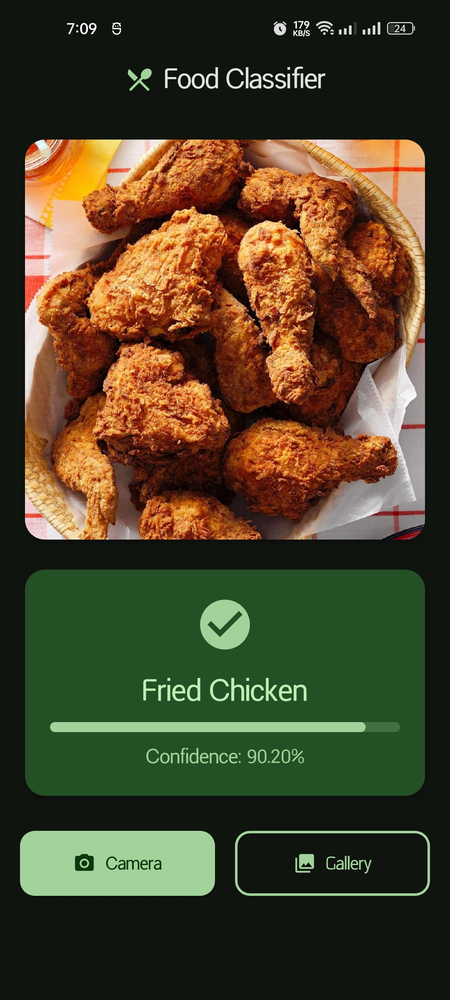
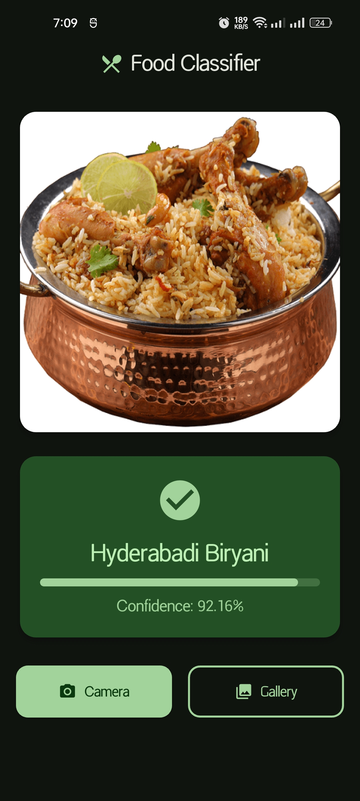

# Food Classifier App

A fast and accurate mobile application that identifies food items using on-device machine learning. Simply take a photo or select one from your gallery, and instantly get the classification result with confidence levels.

## Screenshots

<table style="border: none; border-collapse: collapse;">
  <tr>
    <td></td>
    <td></td>
  </tr>
</table>

## Features

- **Lightning-Fast Classification**: Powered by an optimized TensorFlow Lite model that runs entirely on your device
- **Extensive Food Database**: Recognizes over 2,000 different food items
- **Dual Input Methods**:
    - Capture photos directly using your camera
    - Select existing images from your gallery
- **Confidence Scoring**: View the model's confidence level for each prediction
- **On-Device Processing**: All inference happens locally, ensuring privacy and eliminating the need for internet connectivity

## How It Works

1. **Select Input**: Choose to take a new photo with your camera or select an existing image from your gallery
2. **Instant Analysis**: The TensorFlow Lite model processes the image directly on your device
3. **View Results**: See the identified food item along with the confidence percentage

## Technical Highlights

- **Model**: Custom TensorFlow Lite (.tflite) model optimized for mobile deployment
- **Performance**: Blazing-fast inference on all device types
- **Classification Range**: 2,000+ food categories
- **Privacy-First**: No data leaves your device

## Use Cases

- **Dietary Tracking**: Quickly identify foods for nutrition logging
- **Food Discovery**: Learn about unfamiliar dishes and ingredients
- **Educational Tool**: Teach children about different food types
- **Restaurant Assistance**: Identify dishes when dining out

## Requirements

- Android/iOS device
- Camera permission (for taking photos)
- Gallery/Storage permission (for selecting images)

[//]: # (## Installation)

[//]: # ()
[//]: # ([Add installation instructions specific to your distribution method - Play Store, App Store, or direct APK/IPA])

## License

This project is licensed under the MIT License - see the [LICENSE](LICENSE) file for details.

## Contact

Md. Maksaline Haque Sajib
[Visit Website](https://www.maksaline.com)
[Contact me](mailto:sajib19285@gmail.com?subject=Food%20Classification%20App%20Inquiry)

---

**Note**: Classification accuracy depends on image quality, lighting conditions, and how clearly the food item is visible in the photo.